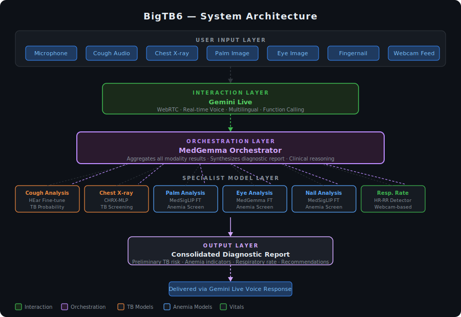

# BigTB6

BigTB6 is a multimodal, voice-driven preliminary tuberculosis screening system. It integrates cough audio analysis, palm/eye/nail imagery, real-time respiratory rate monitoring, and chest X-ray analysis into a unified diagnostic interface.

**Deployed Link:** https://big-tb6.vercel.app/
---
**Demo video:** https://youtu.be/ubBDRxCwaeE?si=Qhmsw11RnrE3HNZH
---
## Architecture


BigTb6 is structured across four layers:

1. **Interaction Layer — Gemini Live**: Handles all real-time voice communication with the user over WebRTC. It is multilingual and uses function calling to invoke the appropriate screening tools based on the conversation context.

2. **Orchestration Layer — MedGemma**: Acts as the clinical reasoning core. Once all modality-specific models return their results, MedGemma aggregates the outputs, interprets them in context, and generates a consolidated preliminary diagnostic report with risk indicators and recommendations.

3. **Specialist Model Layer**: A set of independently fine-tuned models, each responsible for a single screening modality (see table below). They are invoked by the orchestrator as needed.

4. **Output Layer**: The final report is synthesized by MedGemma and delivered back to the user through Gemini Live as a voice response.

## Features

- **Voice Conversation** — Real-time microphone-based interaction via WebRTC streaming
- **Cough Analysis** — Record cough audio and receive TB probability scoring
- **Chest X-ray Analysis** — Upload X-ray images for TB screening
- **Palm Analysis** — Capture palm image for anemia screening
- **Eye Analysis** — Capture lower-eyelid image for anemia screening
- **Fingernail Analysis** — Capture fingernail image for anemia screening
- **Respiratory Rate Monitor** — Real-time respiratory rate estimation via webcam
- **Report Generation** — Consolidated diagnostic report synthesized from all modality results
- **Tool Integration** — Gemini Live function calling for multimodal tool orchestration

---

## Models

| Modality | Repository | Weights |
|---|---|---|
| Cough Analysis | [Hear-Cough-Finetuning](https://github.com/SACHokstack/Hear--Cough-Finetuning) | [sach3v/Domain_aware_dual_head_HEar](https://huggingface.co/sach3v/Domain_aware_dual_head_HEar) |
| Palm Analysis | [palm-medsiglip](https://github.com/Sidharth1743/palm-medsiglip) | — |
| Nail Analysis | [Medsiglip-fingernail-finetune](https://github.com/Sidharth1743/Medsiglip-fingernail-finetune) | — |
| Eye Analysis | [medgemma-tb](https://github.com/Sidharth1743/medgemma-tb) | — |
| Fingernail Anemia Detection | [nail-anemia-detection](https://github.com/LE-TAPU-KOKO/nail-anemia-detection) | [JetX-GT/nail-anemia-detector](https://huggingface.co/JetX-GT/nail-anemia-detector) |
| Chest X-ray Analysis | [CHRX-MLP-LINEAR_PROBE](https://github.com/LE-TAPU-KOKO/CHRX-MLP-LINEAR_PROBE) | [JetX-GT/hades-hellix-tb-linear-probe](https://huggingface.co/JetX-GT/hades-hellix-tb-linear-probe) |
| Respiratory Rate Monitor | [HR-RR-detector](https://github.com/Sidharth1743/HR-RR-detector) | — |

## Cloud Run Deployments

All specialist models are containerized and deployed on Google Cloud Run for scalable, unauthenticated access. Each service exposes a REST endpoint consumed by the MedGemma orchestrator.

| Service | Endpoint | Method | Route |
|---|---|---|---|
| Cough Analysis (HeAR TB) | `https://hear-tb-1039179580375.us-central1.run.app` | POST | `/predict` |
| Chest X-ray (Hades Hellix) | `https://chest-xray-1039179580375.us-central1.run.app` | POST | `/analyze-tb` |
| Palm Anemia | `https://palm-anemia-1039179580375.us-central1.run.app` | POST | `/predict` |
| Nail Anemia | `https://nail-anemia-1039179580375.us-central1.run.app` | POST | `/predict` |
| Respiratory Rate (Respira-Sense) | `https://respira-medsiglip-1039179580375.us-central1.run.app` | POST | `/predict` |


## Prerequisites

- Python 3.12+
- Node.js 18+
- Google API Key (for Gemini Live)
- Daily.co API Key (for WebRTC)

## Setup

### 1. Clone and Install Dependencies

```bash
# Clone the repository
git clone <repository-url>
cd GEMINI_LIVE

# Setup backend virtual environment
cd server
python -m venv venv
source venv/bin/activate  # On Windows: venv\Scripts\activate
pip install -r requirements.txt

# Setup frontend
cd ../client
npm install
```

### 2. Configure API Keys

Create a `.env` file in the `server` directory:

```bash
# server/.env
GOOGLE_API_KEY=your_google_api_key_here
DAILY_API_KEY=your_daily_api_key_here
```

**Getting API Keys:**
- **Google API Key**: Get from [Google AI Studio](https://aistudio.google.com/app/apikey)
- **Daily.co API Key**: Get from [Daily.co Dashboard](https://dashboard.daily.co/)

## Running the Application

### Terminal 1 - Bot (WebRTC)

```bash
cd server
./venv/bin/python bot.py -t webrtc --host localhost --port 7860
```

### Terminal 2 - Backend API (Upload + Room)

```bash
cd server
./venv/bin/python main.py
```

### Terminal 3 - Frontend

```bash
cd client
npm run dev
```

### Access the Application

1. Open http://localhost:3000 in your browser
2. Grant microphone and camera permissions
3. Click "Start Consultation"
4. Use the "Chest X‑ray Upload" panel to upload an X‑ray image when needed

## How It Works

### Conversation Flow

1. **Greeting**: BigTB6 introduces itself and asks how you're feeling
2. **Symptom Inquiry**: Ask questions about TB-related symptoms
3. **Cough Analysis**: When you mention a cough, the bot records and analyzes the cough audio
4. **Palm/Eye/Nail Analysis**: When you mention these concerns, the bot captures an image and returns an analysis in the same tool call
5. **Chest X‑ray Analysis**: After uploading an X‑ray, ask the bot to analyze the chest X‑ray

### Tools

| Tool | Description |
|------|-------------|
| `record_cough_sound` | Records user's cough audio |
| `analyze_cough_for_tb` | Analyzes recorded cough for TB probability |
| `capture_palm_photo` | Captures palm image and returns analysis |
| `capture_eye_photo` | Captures eye image and returns analysis |
| `capture_fingernail_photo` | Captures fingernail image and returns analysis |
| `analyze_chest_xray` | Analyzes most recently uploaded chest X‑ray |

### Backend Architecture

```
┌─────────────┐     WebRTC      ┌─────────────┐
│   Client    │ ◄──────────────► │   Backend   │
│  (Browser)  │                 │ (Python)    │
└─────────────┘                 └─────────────┘
                                        │
                                        ▼
                               ┌─────────────┐
                               │ Gemini Live │
                               │    API      │
                               └─────────────┘
                                        │
                                        ▼
                               ┌─────────────┐
                               │  TB Audio   │
                               │  Analysis   │
                               │    API      │
                               └─────────────┘
```

## Project Structure

```
GEMINI_LIVE/
├── client/                 # Next.js frontend
│   ├── app/              # Next.js app directory
│   ├── components/        # React components
│   └── package.json      # Frontend dependencies
├── server/                # Python backend
│   ├── bot.py            # Main bot with Pipecat
│   ├── tb_audio_tool.py  # TB cough analysis API
│   ├── palm_anemia_tool.py  # Palm anemia API
│   ├── eye_anemia_tool.py   # Eye anemia API
│   ├── nail_anemia_tool.py  # Nail anemia API
│   ├── chest_xray_tool.py   # Chest X‑ray TB API
│   ├── xray_store.py     # Latest X‑ray path store
│   ├── main.py           # FastAPI server (upload + room)
│   ├── requirements.txt  # Python dependencies
│   └── venv/             # Virtual environment
├── docs/                  # Documentation
│   └── plans/            # Implementation plans
└── pipecat/              # Custom Pipecat fork
```

### Customizing the Bot

Edit `server/bot.py` to:
- Change the system prompt/behavior
- Add new tools
- Modify conversation flow

## License

MIT License

## Credits

- [Pipecat](https://pipecat.ai/) - Real-time voice AI framework
- [Google Gemini Live API](https://ai.google.dev/gemini-api/docs/live) - Multimodal live AI
- [Daily.co](https://daily.co/) - WebRTC infrastructure
